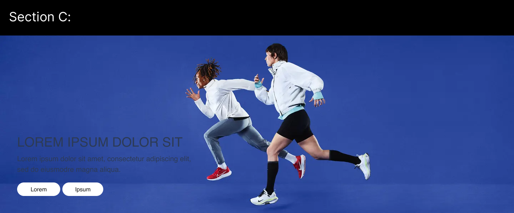
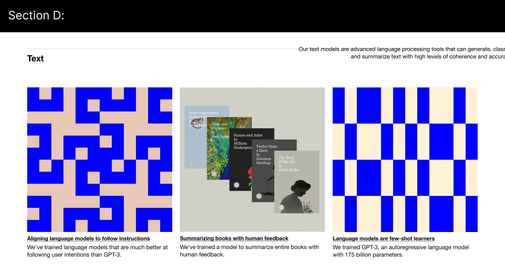
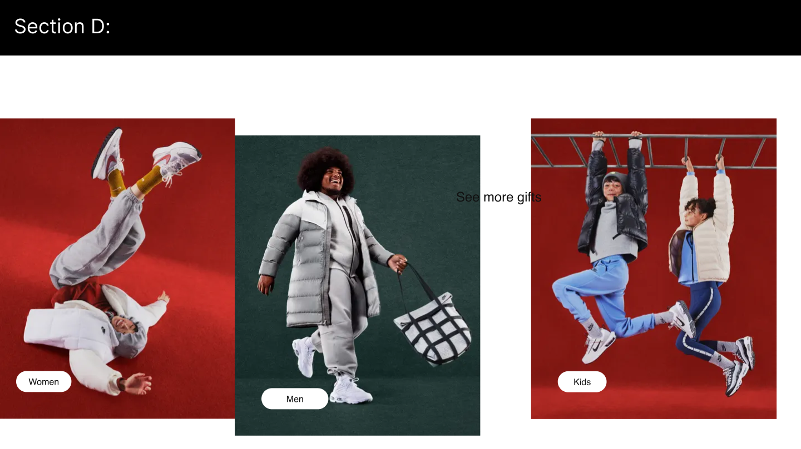

# GPT4-V is terrible at web design

This repo is a short set of simple experiments that test whether GPT4-V understands web design.

**Short answer:** It doesn't. (Yet).

## Background

I recently played a lot with multi-modal models to see whether they can genereate good web designs (for the purpose of [Easyblocks](https://docs.easyblocks.io)). At first I thought it would be probably possible but the deeper I went the more disappointed I was. It turns out that currently (as of 15.12.2023) GPT4-V is absolutely clueless about understanding even most basic design rules which makes me doubt whether it's capable (for now) to generate good designs.

## Experiments

I created 12 similar experiments:
1. I make a screenshot of a section from a well-designed website ([openai.com](https://openai.com) or [nike.com](https://nike.com))
2. I create 3 additional variants of this section, each one having obvious design flaws.
3. I ask GPT4-V which one is correct.

## Results

**2/12 correct, 10/12 errors.**

Success rate is only **16%** even though for the examples are absolutely trivial. The reasoning shows zero understanding of design harmony. Even the reasoning for correct answers is not very convincing.

### Example 1

Here's a banner section from Nike website. The correct section is obviously A:

GPT4-V answer: C ❌

Reasoning:

> Section C appears to be the correctly designed one based on the images provided. Here's the reasoning:
>
> - In Section A, the text "LOREM IPSUM DOLOR SIT" overlays the image of the individuals, making it hard to read and cluttering the visual focus of the section.
> - Section B exhibits the same issue, with the text overlaying the individuals, and it's also centralized, which doesn't seem to fit well with the overall layout.
> - Section C positions the title and the description text neatly below the image, which creates a cleaner division between text and visual content, improving readability and overall aesthetic.
> - Section D also keeps the text away from the image, but the text alignment to the left in conjunction with the image composition looks slightly unbalanced compared to Section C.
>
> Section C provides a clean and organized design by separating the image and text effectively, which is typically a good practice in web design for both aesthetics and functionality.

The reasoning is very bad and shows a lack of basic understanding of design harmony.

### Example 2

Here's another one, a grid section from OpenAI website. Section A is correct, the rest has obvious design errors:

GPT4-V answer: C ❌

Reasoning again shows lack of fundamental understanding of design:

> Section C appears to be the most correctly and cleanly designed. The other sections have the following issues:
> 
> - Section A: The text "Language models are few-shot learners" is obscured by the pattern in the background, making it difficult to read.
> - Section B: The text "few-shot learners" within the statement "Language models are few-shot learners" wraps onto a second line unnecessarily and is also obscured by the pattern.
> - Section D: The end of the sentence "We've trained GPT-3, an autoregressive language model with 175 billion parameters" is obscured by the background pattern, similar to Section A.
> 
> Only Section C does not seem to have any text readability issues caused by overlapping with the background pattern, making it the most cleanly designed section in terms of legibility and layout.

## Thoughts

**TL;DR; I think that LLMs are perfect for design understanding, they just haven't been pre-trained for it yet.**

Let's start with a basic question: why do things look good or bad?

It's hard to answer this one with words. At the end of the day it all comes down to this feeling that design "clicks" or it doesn't. It's not about words, it's about a perceived feeling of visual harmony.

However, we can distill a lot of basic design rules:
- text blocks shouldn't overlap
- title should be larger than body text
- stack items should be aligned etc.
- the characters in a font must be visually consistent with each other.

We could find hundreds of these. People don't like fonts in which characters are not consistent with each other. But what does "consistent" even mean? Font designers know a lot of logical "heuristics" to provide this consistency, the stroke widths, the angles, the curves, the spacing, etc. **I'm pretty sure that if we tried hard enough we'd find some maths behind it.**

But designers are not mathematicians. They work in a different way. They watch billions of designs and they develop a feeling of what looks good and what doesn't. They don't think about it, they just feel it. Design process is basically a "trial and error" until something clicks.

So there are 2 facts:
1. Design has logical rules.
2. The rules are subconciously understood by people, they're not formal in any way.

**I think it's a perfect use case for large transformer models.** If a large model was pre-trained with a huge amount of good designs (without any labeling) it would understand the rules about those designs in the same way designers do by watching hundreds of inspirations a day. And it's gonna be a game changer.

The experiments in this repo show that GPT4-V is not there yet. My feeling is that it wasn't pre-trained on enough designs.

## How experiments are run?

1. In `data/screenshots` there are 12 sets of screenshots. `0.png` is correct and `1.png`, `2.png`, `3.png` are incorrect.
2. Each experiment is run 4 times to remove randomness. Only if the model answers correctly 4/4 we treat experiment as successful.
3. In each experiment run we randomize the images order and label the images so that the model knows which one is which.
4. We use follownig prompt:

> Hey, here a couple screenshots of a section from a webpage. Each section has the same content but is designed a bit differently. Sections are labelled "A", "B", "C" and "D".
>
> Only one of the sections is correctly and cleanly designed, the rest have some obvious design flaws. Tell me which one is correct.
>
> Please make the first 2 characters of your answer #A, #B, #C or #D depending on which section you think is correctly designed. This is SUPER IMPORTANT. After that you can give your reasoning.

You can find the code in [main.py](./main.py) file.

# All examples

### Example 1

- wrong ❌
- correct answer: C
- AI answer: B

Reasoning:
> : The correctly designed section appears to be Section B. This is based on the observation that the text layout and graphic elements are clean, well-organized, and there are no overlapping elements or visual clutter. The heading "Text" is aligned properly and the body text appears well-structured and clearly legible. The images are neatly arranged with appropriate spacing, contributing to an overall cohesive design. Other sections contain misalignments, overlapping text and images, and other visual inconsistencies that detract from a clean and professional layout.

### Example 2

- wrong ❌
- correct answer: A
- AI answer: C

Reasoning:
>  Section C appears to be the correctly designed one based on the images provided. Here's the reasoning:
>
> - In Section A, the text "LOREM IPSUM DOLOR SIT" overlays the image of the individuals, making it hard to read and cluttering the visual focus of the section.
> - Section B exhibits the same issue, with the text overlaying the individuals, and it's also centralized, which doesn't seem to fit well with the overall layout.
> - Section C positions the title and the description text neatly below the image, which creates a cleaner division between text and visual content, improving readability and overall aesthetic.
> - Section D also keeps the text away from the image, but the text alignment to the left in conjunction with the image composition looks slightly unbalanced compared to Section C.
>
> Section C provides a clean and organized design by separating the image and text effectively, which is typically a good practice in web design for both aesthetics and functionality.

### Example 3

- wrong ❌
- correct answer: D
- AI answer: C

Reasoning:
>
>
> In Section C, the layout is clean, with each block of text aligned appropriately with its corresponding image, making it visually accessible and easy to follow. The heading, subheadings, and body text are all neatly organized, and the images are properly sized and spaced.
>
> Let's look at the issues in the other sections to explain why Section C is the correct choice:
>
> - Section A: The heading for the image is misplaced below the image rather than above it, which goes against conventional layout practices where titles or headings usually precede the content they're related to.
>
> - Section B: There is an overlay of text on the images which makes the text hard to read and interferes with the ability to view the images clearly. Additionally, there are alignment issues with the subheadings and body text which creates a disorganized look.
>
> - Section D: The layout is more conventional like Section C; however, Section D contains a subtle design flaw where the subheadings and the related text blocks have varying alignments, making the overall appearance less structured and professional compared to Section C.
>
> Therefore, Section C is the correctly and cleanly designed section.

### Example 4

- wrong ❌
- correct answer: A
- AI answer: C

Reasoning:
> : Section C appears to be the most correctly and cleanly designed. The other sections have the following issues:
>
> - Section A: The text "Language models are few-shot learners" is obscured by the pattern in the background, making it difficult to read.
> - Section B: The text "few-shot learners" within the statement "Language models are few-shot learners" wraps onto a second line unnecessarily and is also obscured by the pattern.
> - Section D: The end of the sentence "We've trained GPT-3, an autoregressive language model with 175 billion parameters" is obscured by the background pattern, similar to Section A.
>
> Only Section C does not seem to have any text readability issues caused by overlapping with the background pattern, making it the most cleanly designed section in terms of legibility and layout.

### Example 5

- wrong ❌
- correct answer: B
- AI answer: D

Reasoning:
>  is the section that is correctly and cleanly designed.
>
> In Section D, the text and buttons are aligned to the left, which creates a clean and organized look. It also respects the readability and natural reading flow from left to right in Western cultures. The elements are grouped in a way that makes logical sense, reinforcing the overall cohesiveness of the design. The clear space on the right balances the visual weight of the left-aligned text, creating an aesthetically pleasing layout.
>
> In contrast:
>
> - Section A has text overlaying the image where the text contrasts poorly against the background, making it hard to read.
> - Section B has the text centered, which can make it difficult to read as the eye has to move back to the center to begin each line.
> - Section C has the buttons misaligned, which disturbs the visual harmony and expected structure.

### Example 6

- wrong ❌
- correct answer: A
- AI answer: D

Reasoning:
>
>
> Section D appears to be the correctly designed section. Here's why:
>
> 1. The text is well-organized and legible, with good use of whitespace.
> 2. The heading "Pioneering research on the path to AGI" is on one line, which makes it easy to read and gives it prominence.
> 3. The paragraph text is a reasonable length for easy reading and is well-aligned with the heading and call-to-action buttons.
> 4. The call-to-action buttons "View research index" and "Learn about safety" are clearly visible and well-positioned for user interaction.
>
> In comparison, the other sections have the following issues:
>
> - Section A: The text is evenly distributed, but the alignment is split inappropriately across the column which can make it harder to read.
> - Section B: The title is broken up and wraps oddly, disrupting the flow and making the text harder to scan.
> - Section C: The text overlaps with the image, creating a cluttered look and making the text difficult to read.

### Example 7

- wrong ❌
- correct answer: C
- AI answer: A

Reasoning:
> : Section A appears to be the correctly designed version. The layout is clean with a clear distinction between text and image areas, and there is a nice balance of elements. The header "Pioneering research on the path to AGI" is prominent and clear, and the body text is nicely aligned. The call-to-action buttons "View research index" and "Learn about safety" are well positioned and easily noticeable. There is also a cohesive color scheme that is appealing to the eye without any text overlaying the image which ensures readability.

### Example 8

- correct ✅
- correct answer: B
- AI answer: B

Reasoning:
> : Section B appears to be the correctly designed one. Each category (Women, Men, Kids) is presented with corresponding images directly above the labels, making it easy for viewers to understand the categorization at a glance.
>
> Here are the issues with the other sections:
>
> - Section A: The images are inverted, which makes it confusing as the labels "Women," "Men," and "Kids" do not line up correctly with their respective images.
>
> - Section C and Section D: Both have alignment issues where not all of the images line up correctly with their respective labels. In Section C, the image for "Men" is not directly above its label, and in Section D, the "See more gifts" text is not aligned with the rest of the content, disrupting the visual coherence.

### Example 9

- correct ✅
- correct answer: A
- AI answer: A

Reasoning:
> : Section A appears to be the correctly and cleanly designed section among the options provided. Here's the reasoning:
>
> In Section A, the text is well aligned, the font size is readable, and the quote is set in a way that makes it stand out while remaining coherent. The name and title of the person quoted are appropriately placed below the quote, which follows common design conventions for testimonials or quotes.
>
> The other sections have various issues:
> - Section B: The text alignment is awkward, with a wide left margin and the text bunched to the right, making it hard to follow and aesthetically unpleasing. The name and title at the bottom are too far to the right.
> - Section C: While the text alignment is centered, this is uncommon and not considered best practice for large blocks of text, as it can make reading more difficult. The name and title are aligned with the left margin of the text block, but it creates a jagged right margin.
> - Section D: The text here is justified, which can create irregular spacing between words, making it less comfortable to read. Additionally, there appear to be issues with hyphenation and word breaking ("techniques to help us fill the gaps" is broken awkwardly), and the name and title are misplaced and overlap with the quote.

### Example 10

- wrong ❌
- correct answer: C
- AI answer: B

Reasoning:
>  is the correctly designed section.
>
> Section B presents the text in a coherent, legible format with appropriate line breaks, capitalization, and alignment. The quotation marks are used correctly, and the text is evenly spaced, making it easy to read. The author's name and title are properly positioned and formatted below the quote.
>
> In comparison:
> - Section A has irregular spacing and alignment issues, particularly with the text "Researcher at OpenAI" being disproportionately small and misaligned relative to the name above it.
> - Section C looks visually imbalanced due to the uneven spacing around the quote and the author attribution.
> - Section D has a variety of design flaws, including incorrect usage of capital letters in the sentence, improper line breaks, and spacing issues that lead to a less professional and polished look.

### Example 11

- wrong ❌
- correct answer: A
- AI answer: C

Reasoning:
>  is the correctly designed section.
>
> In Section A, the text is overlaying the image in a way that makes it hard to read due to insufficient contrast and lack of background for the text area.
>
> Section B has multiple issues, including poor alignment of elements, and the text "LOREM IPSUM DOLOR SIT" is split which disrupts the reading flow. The colors and button design also lack consistency.
>
> Section C, on the other hand, presents a clean and neat design with a clear contrast between the background image and the text overlay, which is aided by a semi-transparent darkening of the image behind the text. This increases readability without distracting from the imagery. The text and buttons are neatly aligned, maintaining a good structure and visual hierarchy.
>
> Section D also has issues similar to Section A, where the text is directly overlaid on the image, causing readability issues due to low contrast between the text and the background, especially on the left side of the image.

### Example 12

- wrong ❌
- correct answer: B
- AI answer: D

Reasoning:
>  Based on the images provided, Section D appears to be the most correctly and cleanly designed. The reasoning is as follows:
>
> - Section A has overlapping text and buttons that obstruct the clarity and readability of the content.
> - Section B displays an issue where the button backgrounds are transparent, which makes the text hard to read, especially on the varying background colors.
> - Section C has an alignment issue where the button on the left appears to be cut off or is not aligned properly with the text above it.
>
> Section D, however, seems to have correct alignment, clear button backgrounds, and no overlapping issues, leading to a clean and aesthetically pleasing design.

